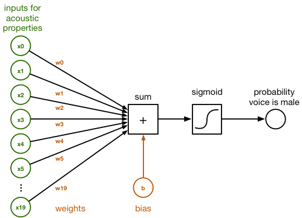
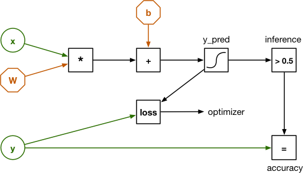

These are notes related to this [article](http://machinethink.net/blog/tensorflow-on-ios/).


__TensorFlow__: library for _building computational graphs_ -> Machine learning.  
It's a toolkit for _implementing new machine learning algorithms_.  
It comes with a collection of reusable building blocks, and you can use other libraries to provide more feature on top of TensorFlow.


#### Binary Classification with logistic regression:


A __classifier__ takes some input data and then tells you which category - or class - this data belongs to.

For this project we have two classes:
    - male
    - female
Therefore, it is a _binary_ classifier.


* Input data consists of 20 numbers that represent various acoustic properties of a particular recording of someone speaking. (audio frequencies)




The connections have different weights, which correspond to how important each of these 20 numbers is, according to the classifier.


Inside the `sum` block:
```
sum = x[0]*w[0] + x[1]*w[1] + x[2]*w[2] + ... + x[19]*w[19] + b
```

> We add a _bias_ at the end.


* The weights in the array __w__ and the value of __b__ represent what the classifier has learned.

> Training the classifier is a matter of finding the right number for _w_ and _b_.

Initially, the two parameters will start at __0__ and after many rounds of training, they will contain a set of numbers that the classifier can use to tell apart male from female.


* Converting the `sum` into a probability, we apply _logistic sigmoid_ function:
```
y_pred = 1 / (1 + exp(-sum))
```

If `sum`:
    * large positive -> returns 1
    * large negative -> returns 0
    * close to 0 -> returns 0.5


* We end up with a probability that the sound is a male sound.

We need to build the mechanics for training the classifier => TensorFlow.


#### Implementing the classifier in TensorFlow:


To use the classifier, we need to turn its design into a _computational graph_ first.

> Computational graph consists of nodes that perform calculations, and of the data that flows between these nodes.





* _x_ is represented by a vector and _w_ by a matrix.  
The sum is then a simple matrix multiplication.
* _y_ is used for training the classifier and for verifying how well it works.  
The dataset we are using has 3,168 examples of recorded speech and for each example, we know whether it was made by a male voice or a female voice.  
These __labels__ of the dataset will be into this variable.


To train the classifier:
    * Load one of the examples into x and let the graph make a prediction.
    * Initially the classifier will likely make the wrong prediction.
    * Calculate "how much" wrong it is, which is done by __loss function__.
    * _loss function_ compares the predicted outcome `y_pred` with the correct outcome `y`.
    * We use a technique called __backpropagation__ to go backwards through the computational graph to adjust `w` and `b`.


> The training procedure is repeated for all examples from the data set until the graph settles on an optimal set of weights.
> The loss consequently becomes lower over time.


The cool thing about TensorFlow is since we expressed all the "forward" operations as nodes in a graph, it can automatically figure out what the "backward" operations are for doing backpropagation, and you don't have do any of the math yourself.


#### Tensor:

A tensor is in fact __n-dimensional array__.


* A scalar number -> 0th order tensor
* A vector -> 1st order tensor
* A matrix -> 2nd order tensor
* A three-dimensional array -> 3rd order tensor
* ...


> By expressing our graph in terms of matrices/tensors, we can make predictions for many examples at once.


#### The data:


We are using this [data](https://www.kaggle.com/primaryobjects/voicegender).

The dataset contains 3168 rows with 20 acoustic features.  
All we care about is that we can use this data to train a classifier so that it can tell male and female voices apart, given these features.


If you want to use voice audio on this trained classifier, you need first to extract these _20 numbers_.

> The data will be in `voice.csv`.

#### Creating a training set and test set:


The given data should be splitted into two:
    - training set
    - test set

The names are self explanatory.


The `split_data.py` program will into two parts.


#### Building the computational graph:


The script that will train the logistic classifier with TensorFlow is [here](https://github.com/hollance/TensorFlow-iOS-Example/blob/master/Scripts/train.py).  

It is available in `train.py`.

#### Training the Classifier:

Training usually happens in an infinite loop.  
For a deep neural network it will take more than few minutes to train it.  
But for this classifier it will only take less than minute.

The checkpoint files are saved to the directory specified in the `checkpoint_dir` in the `train.py` file.


Run the file: `$ python train.py` and once you stop seing that the loss is going down, you press `^C`.

#### Freezing the Graph:

We have the graph definition in `/tmp/voice/graph.pb`.  

The files that are related to a __saved model__:
    * `___.meta`
    * `___.index`
    * `___.data-0000-of-00001`
    * `checkpoint`

Serving the model in production, we only need the model and its weights packaged in 1 file.

To do so, we need to go through these steps:
    - _Retrieve saved graph_: Load previously saved meta graph in the default graph and retrieve its `graph_def`
    - _Restore the weights_: Start a Session and restore the weights
    - _Remove useless metadata_: Grab what is needed to perform inference and return **Frozen graph\_def**
    - _Save it_: Serialize the frozen graph\_def and dump it to the disk.


> Make sure you have already install Tensorflow into your machine.


Before starting the freezing process, go to __tensorflow__ directory and run:
```
$ tensorflow/contrib/makefile/build_all_linux.sh
```

> You can try these two also:
```
$ bazel build tensorflow/python/tools:freeze_graph
$ bazel build tensorflow/python/tools:optimize_for_inference
```

You can do all of this with this command, that you need to run within the __tensorflow__ directory:
```
$ bazel-bin/tensorflow/python/tools/freeze_graph \
--input_graph=/tmp/voice/graph.pb --input_checkpoint=/tmp/voice/model \
--output_node_names=model/y_pred,inference/inference --input_binary \
--output_graph=/tmp/voice/frozen.pb
```

This creates a simplified graph in `/tmp/voice/frozen.pb` which contains everything we need.

The following command simplifies the graph even further and remove unsuported operation for smartphone:
```
$ python -m tensorflow.python.tools.optimize_for_inference \
--input /path/to/graph.pb \
--output /path/to/output_graph.pb \
--input_names=batch/fifo_queue \
--output_names=encode_images/output_pngs/TensorArrayPack_1/TensorArrayGatherV2
```


